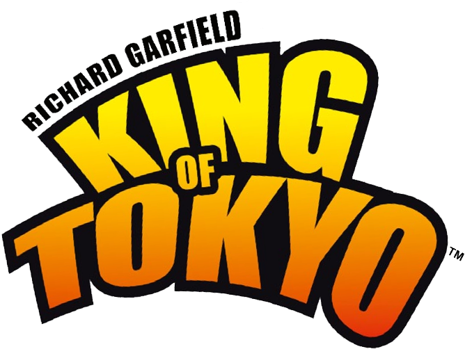
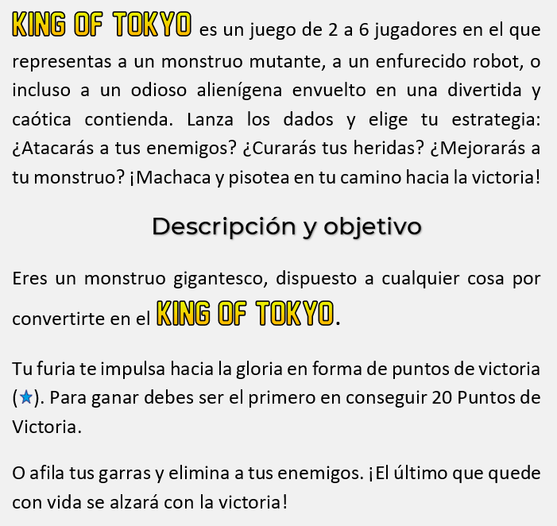

# King Of Tokyo by Richard Garfield



### Desarrollado por Grupo 3 L8-4:
- Ricardo Nadal
- Carlos Varela
- Jose María Delgado
- Noelia López
- Sara Cruz
- Rosa Molina

## ¿Qué es King Of Tokyo?



## Vídeo explicativo del juego de mesa original
<a href="https://youtu.be/ohXMYBgUpqY">Disponible en YouTube</a>

## Jugar King Of Tokyo localmente
King of Tokyo es una aplicación de [Spring Boot](https://spring.io/guides/gs/spring-boot) construida usando [Maven](https://spring.io/guides/gs/maven/). Puedes descargarla ahora desde la ventana de comandos de tu computadora siguiendo estos pasos:


```
git clone https://github.com/gii-is-DP1/dp1-2021-2022-l8-4.git
cd dp1-2021-2022-l8-4
mvn spring-boot:run
```

Accede a la aplicación desde tu navegador favorito mediante este enlace: http://localhost:8080/

## ¿Qué puedes hacer ahora?

### Como usuario
- Empezando por el principio: Regístrate, crea y edita tu perfil personal.
- Juega tu primera partida, únete a una o crea una nueva. En caso de duda, lee las reglas.
- Consulta las estadísticas, accede al ranking global de jugadores o mira tus logros en tu perfil.

### Como administrador
- Gestiona las cuentas de los usuarios.
- Observa un listado de partidas activas o de partidas jugadas.
- Crea nuevos logros y consulta los existentes.

## En caso de que encuentres un bug o una sugerencia de mejora
Nuestro banco de issues se encuentra aquí: https://github.com/gii-is-DP1/dp1-2021-2022-l8-4/issues

# Licencia
King of Tokyo tiene la versión 2.0 de [Apache License](https://www.apache.org/licenses/LICENSE-2.0).
